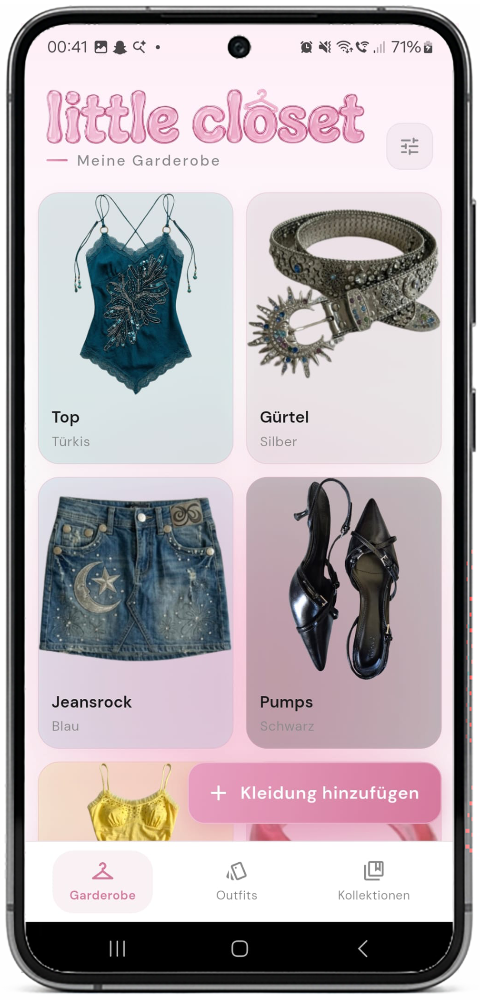
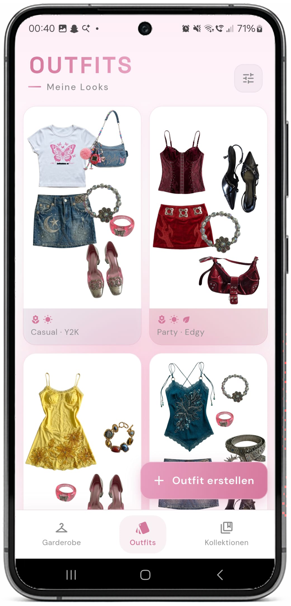
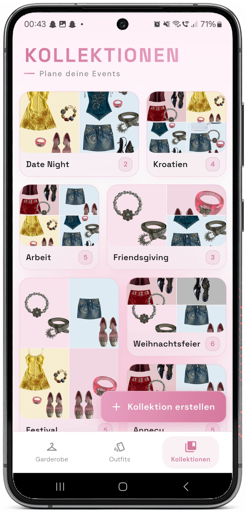

<p align="center">
  
</p>

<h1 align="center">little closet</h1>

<p align="center">
  Garderobe-Management-App für Android &nbsp;·&nbsp; Flutter · Gemini AI · Drift DB
</p>

---

## Setup

### Voraussetzungen
- Flutter SDK (https://docs.flutter.dev/get-started/install)
- Android Studio oder VS Code mit Flutter-Plugin
- Android-Gerät oder Emulator

### 1. Dependencies installieren
```bash
flutter pub get
```

### 2. Gemini API Key eintragen
Datei `assets/.env` anlegen:
```
GEMINI_API_KEY=dein_key_hier
``
Key holen unter: https://aistudio.google.com/app/apikey

### 3. Code generieren (Drift + Riverpod)
```bash
dart run build_runner build --delete-conflicting-outputs
```

### 4. App starten
```bash
flutter run
```

---

## Features

**Garderobe**
- Kleidungsstücke per Kamera oder Galerie hinzufügen
- Automatische KI-Klassifizierung via Gemini 2.5 Flash (Kategorie, Farbe, Stil, Saison)
- Filter nach Kategorie, Farbe, Saison, Stil
- Detail-Ansicht, Bearbeiten, Löschen
- Mehrfachauswahl zum Löschen

**Outfits**
- Drag & Drop Canvas-Editor (Position, Größe, Rotation)
- Automatische Tag-Vorschläge aus den verwendeten Items
- Filter nach Stil, Wetter, Saison
- Export als PNG (weiß oder transparent)
- Mehrfachauswahl zum Löschen

**Kollektionen**
- Kollektionen erstellen und umbenennen
- Outfits per Picker hinzufügen/entfernen
- Automatisch generiertes Mosaic-Cover
- Filter nach Stil, Wetter, Saison
- Mehrfachauswahl zum Löschen

---

## Screenshots

<p align="center">
  
  
  
</p>

---

## Architektur

Feature-basierte Clean Architecture:

```
lib/
├── core/
│   ├── constants/      # Kategorien, Farben, Saison- und Style-Tags (Deutsch)
│   ├── models/         # ClothingClassification (Gemini-Response)
│   ├── navigation/     # App-Routen
│   ├── services/       # GeminiService, RemoveBgService
│   ├── theme/          # LCColors, LCGlass, LCTheme
│   └── widgets/        # Wiederverwendbare UI-Komponenten (LCChip, LCGradientFab …)
├── data/
│   ├── database/       # Drift-Datenbank (Schema v7, Migrationen)
│   └── repositories/   # ClothingRepository, OutfitRepository, CollectionRepository
├── features/
│   ├── wardrobe/       # Garderobe-Feature (vollständig)
│   ├── outfits/        # Outfit-Feature (in Arbeit)
│   └── collections/    # Kollektionen-Feature (in Arbeit)
└── shared/
    └── widgets/        # AppShell (Bottom Navigation)
```

**State Management:** Riverpod — Provider entweder neben dem Repository oder via `@riverpod`-Annotation generiert. Widgets nutzen `ConsumerWidget` / `ConsumerStatefulWidget`.

**Datenbank:** Drift (SQLite). Tabellen in `lib/data/database/tables/`. `List<String>`-Felder (Farben, Saisons, Tags) werden als JSON gespeichert. Bei Tabellenänderungen Schema-Version erhöhen und Migration in `app_database.dart` ergänzen.

**Navigation:** `AppShell` verwaltet die Bottom Navigation per `IndexedStack`. Modale Sheets (`showModalBottomSheet`) für Detail, Upload, Filter und Hinzufügen.

---

## Design System

Glasmorphismus mit Frosted-Glass-Sheets, Rosa-Gradienten und futuristischem Y2K-Designstil; animierte Chips für interaktives Feedback.

**Schriften:** Space Grotesk (Headlines) + DM Sans (Body) — lokal eingebunden (`assets/fonts/`)

| Token | Verwendung |
|-------|------------|
| `LCColors.primary` | Haupt-Akzent, Buttons |
| `LCColors.accent` | Highlights |
| `LCColors.deep` | Kontraste |
| `LCColors.chrome` | Silber, futuristische Details |
| `LCGlass` | Glasmorphismus-Konstanten (Blur, Sheet-Farbe, Border) |

Alle Styling-Token in `lib/core/theme/app_theme.dart`.

---

## Tech Stack

| Bereich | Library |
|---------|---------|
| Framework | Flutter |
| State Management | Riverpod + riverpod_generator |
| Datenbank | Drift (SQLite) |
| KI | Gemini 2.5 Flash (via HTTP) |
| Fonts | lokal (assets/fonts/) |
| Bildauswahl | image_picker |
| Animationen | flutter_animate |
